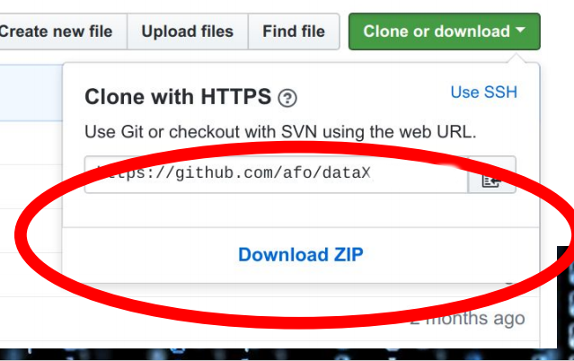

Data-X @ HBKU
======================


### Nov 8 and 11, 2018

This is the official repository for the Data-X seminar and guest lecture at HBKU in Qatar, Doha, November 2018.

#### Outline:
* **Seminar Nov 8:** Introduction to UC Berkeley and SCET, Data-X, guide to resources.
* **Guest Lecture Nov 11:** AI today, Hands on Deep Learning, Blockchain

<a href='https://data-x.blog'>

</a>


## 📚 Resources

* # [Start with the Crash Course](https://github.com/afo/dataXhbku/blob/master/data-x-crash-course.ipynb)
* ## [Install Instructions and Prep Material](https://github.com/afo/dataXhbku/blob/master/install-instructions/setup-installation-masterclass.pdf)
* ### [Data-X Official Website](https://data-x.blog/)
* ##### [Data-X Network](https://data-x.blog/advisors/)
* ##### [Data-X Resources](https://data-x.blog/resources/)
* ##### [Data-X Projects](https://data-x.blog/projects/)


### Download the Masterclass material

To download this Github repository just press the green `Clone or Download` button to the top right.

<p align='center'>
   
</p>
<br>


## ▶️ Usage

To download the material to your computer please [Install git](https://git-scm.com/downloads) and use the Terminal / Command Prompt to clone the repository.

```bash
git clone https://github.com/afo/dataXhbku/
```

Every time the repository is updated, to get the most recent version, `cd` to the cloned `dataXhkbu` folder and run:

```bash
git pull
```

*For more information about Version Control, git, and Github please read this excellent guide: [Introduction to git and Github](https://product.hubspot.com/blog/git-and-github-tutorial-for-beginners)*

---


<h1 align="center">
   
</h1>


## 📧 Contact me

- **Alexander Fred Ojala:** afo @ berkeley edu ([LinkedIn](https://www.linkedin.com/in/alexanderfo/))

## 📁 About

Today, the world is literally reinventing itself with Data, AI, and Blockchain technology.  However, neither leading companies nor the world’s top students have the complete knowledge set to participate in this newly developing world.  This repo provides tools and understanding to boost the ability to implement and understand the emerging data applications of the future.  The material is suitable for individuals interested in understanding of emerging technologies and application opportunities in new ventures, industry project areas, and potential support of research with data technologies.

This is a high paced immersion into data and data science principles in a uniquely practical approach.  It contains a real-life wide ranging project that can be started with guidance for instructors.

## 🎓 License

[Apache2](https://www.apache.org/licenses/LICENSE-2.0)

